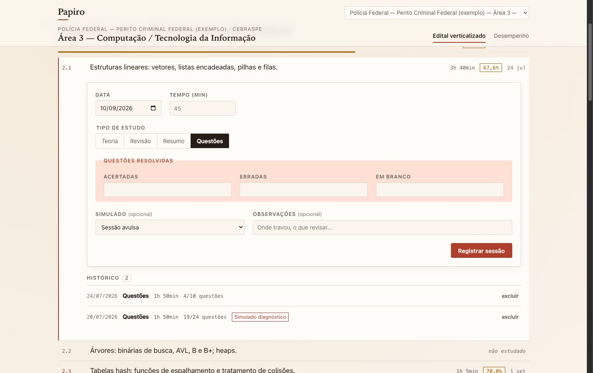

# Papiro

**Gerenciador de edital verticalizado e metricas de estudo** para quem estuda
para varios concursos de TI ao mesmo tempo.

O problema que ele resolve: um candidato que prepara PF Perito (Area 3) e
DATAPREV (Perfil 5) em paralelo tem dois editais, duas bancas, duas numeracoes
e assuntos que se sobrepoem sem serem o mesmo item. Planilha resolve ate o mes
dois; depois disso ninguem sabe mais qual topico foi estudado em qual edital,
nem qual deles esta com o pior percentual de acerto.

Papiro modela isso como banco relacional de verdade: `Concurso -> Cargo ->
Disciplina -> Topico -> Sessao de Estudo`, com as regras de negocio impostas
pelo Postgres, nao apenas pelo formulario.

---

## Stack

| Camada | Escolha |
| --- | --- |
| Banco | PostgreSQL 16 |
| ORM | Prisma (migrations versionadas + client tipado) |
| API | Node.js 22 + Express 5 + TypeScript |
| Validacao | Zod nas bordas (env, body das requests) |
| Frontend | React 19 + Vite + TypeScript |
| Dados no front | TanStack Query (servidor) + URL (navegacao) |
| Formularios | React Hook Form + Zod |
| Graficos | Recharts, carregado sob demanda |
| Infra local | Docker Compose (Postgres + API + Adminer) |

---

## Como rodar

Pre-requisitos: Docker Desktop e Node 22 (o frontend roda no host).

```bash
cp .env.example .env
docker compose up -d                       # Postgres + API + Adminer

cd api && cp .env.example .env
npm install && npm run prisma:generate
npm run prisma:migrate                     # cria o schema
npm run seed -- --demo                     # editais de exemplo + historico ficticio

cd ../web && npm install && npm run dev
```

| Servico | URL |
| --- | --- |
| Frontend | http://localhost:5173 |
| API (health) | http://localhost:3333/api/health |
| Adminer | http://localhost:8081 |
| Postgres (host) | `localhost:5433` |

O Postgres e publicado na **5433** de proposito, para nao colidir com uma
instalacao local na 5432. Dentro da rede do Compose a porta continua sendo 5432.

Para derrubar tudo, inclusive os dados:

```bash
docker compose down -v
```

> Ao adicionar uma dependencia nova na API, rebuildar a imagem nao basta: o
> volume anonimo de `node_modules` sobrevive e cobre o da imagem nova. Use
> `docker compose up -d --build --renew-anon-volumes api`.

---

## Estrutura

```text
Papiro/
├── api/                  # Express + Prisma
│   ├── prisma/
│   │   ├── data/         # editais em lote [disciplina, codigo, descricao]
│   │   ├── migrations/   # geradas pelo Prisma + uma escrita a mao
│   │   ├── schema.prisma
│   │   └── seed.ts
│   └── src/
│       ├── middlewares/  # erro terminal, 404
│       ├── routes/       # rotas por recurso
│       ├── http/        # envelope, erros, traducao dos erros do Postgres
│       ├── lib/         # client do Prisma, helpers de data
│       ├── modules/     # um diretorio por recurso (routes + schema + service)
│       ├── app.ts        # composicao do Express
│       ├── env.ts        # validacao Zod das variaveis de ambiente
│       └── server.ts     # bootstrap
├── web/                  # React + Vite
│   └── src/
│       ├── components/   # por feature: edital/, sessao/, dashboard/, ui/
│       ├── hooks/        # React Query por recurso
│       ├── lib/          # cliente HTTP e formatadores
│       ├── paginas/      # uma por rota
│       └── styles/       # tokens.css e global.css
├── db/
│   ├── schema.sql        # tabelas, enum, CHECKs e indices (leitura humana)
│   └── views.sql         # as duas views de dashboard
├── docs/
└── docker-compose.yml
```

---

## Modelo de dados

```text
Concurso (edital + banca)
└── Cargo (o perfil disputado)
    ├── Disciplina (peso na prova)
    │   └── Topico (codigo literal do edital + descricao)
    │       └── SessaoEstudo  ← fact table
    └── Simulado ──────────────┘ (agrupa sessoes de varias disciplinas)
```

Cinco decisoes de modelagem sustentam o resto do projeto:

**1. Concurso e o nivel raiz, acima de Cargo.** "Seguranca da Informacao" do
edital da PF e do edital da DATAPREV sao duas disciplinas diferentes, com
numeracao e redacao proprias. Se o Cargo fosse a raiz, os dois editais
colidiriam e o percentual de acerto de um contaminaria o do outro. O seed
demonstra isso de proposito: IDS/IPS/SIEM existe nos dois editais, com codigos
`7.5` e `3.4` e textos distintos.

**2. Sessao de Estudo e fact table, nao contador.** Uma linha por sessao
realizada, imutavel depois de gravada. Nenhuma tabela guarda "total de minutos
do topico": esse numero e `SUM(...) GROUP BY` sobre os fatos. Contador agregado
e mutavel mente na primeira exclusao de sessao — e excluir sessao e uma
funcionalidade prevista.

**3. Tempo so em minutos, inteiro.** Horas sao formatacao, nao dado. Persistir
os dois formatos cria a possibilidade de eles discordarem, e um dia discordam.

**4. As regras vivem no banco, nao so no formulario.** A regra condicional das
questoes e um `CHECK constraint`, nos dois sentidos: sessao de `Questões` exige
os tres contadores, e sessao de qualquer outro tipo exige que os tres sejam
nulos — sem a segunda metade, o banco aceitaria "Teoria com 30 acertos".
Validar so no React protegeria apenas quem entra pelo React; um `INSERT` pelo
Adminer, um script de importacao ou um bug na API passariam batido.

Prova de que a regra e do banco, e nao da aplicacao:

```text
INSERT ... tipo_estudo='Questões', contadores NULL  -> ERRO 23514 chk_questoes_obrigatorias
INSERT ... tipo_estudo='Teoria',   contadores 10/2/1 -> ERRO 23514 chk_questoes_obrigatorias
INSERT ... tempo_minutos=0                           -> ERRO 23514 chk_tempo_minutos_positivo
INSERT ... questoes_acertadas=-5                     -> ERRO 23514 chk_questoes_nao_negativas
```

**5. Simulado e entidade, nao um valor de `tipo_estudo`.** Um simulado cobre
varias disciplinas de uma vez. Como entidade, ele agrupa as sessoes geradas por
aquela prova (`simulado_id` opcional em `sessoes_estudo`), e o mesmo dado serve
para duas leituras: o desempenho por topico e o resultado consolidado do
simulado. Como valor de enum, o simulado seria uma sessao unica grudada em um
topico so, e a informacao de quais assuntos ele cobriu se perderia.

### Agregacao mora em views

`vw_desempenho_disciplina` e `vw_desempenho_topico` fazem o `SUM`/`GROUP BY` e
o calculo de percentual de acerto. A aplicacao le e desenha; ela nao recalcula
estatistica em JavaScript. O `LEFT JOIN` garante que disciplina sem nenhuma
sessao apareca zerada no dashboard em vez de sumir da lista, e o `NULLIF`
protege a divisao enquanto nenhuma questao foi resolvida.

---

## Banco de dados: comandos

```bash
cd api
cp .env.example .env               # DATABASE_URL para a CLI rodando no host
npm run prisma:migrate             # aplica as migrations
npm run prisma:generate            # regenera o Prisma Client
npm run seed                       # importa os dois editais de exemplo
npm run seed -- --demo             # importa e gera historico ficticio de estudo
```

O seed e **idempotente**: ele remove a importacao anterior daquele concurso (o
`ON DELETE CASCADE` limpa cargos, disciplinas, topicos e sessoes) antes de
recriar. Rodar duas vezes nao duplica nada.

> Os editais em `api/prisma/data/` sao **dados de exemplo**, aproximacoes
> escritas para exercitar o modelo. Para usar os itens reais, basta substituir o
> array `itens` de cada arquivo — o formato e exatamente
> `[disciplina, codigoEdital, descricao]`.


---

## API

Todas as respostas usam o mesmo envelope, no sucesso e no erro:

```jsonc
{ "success": true,  "data": { /* ... */ }, "error": null }
{ "success": false, "data": null, "error": "Dados invalidos.",
  "detalhes": { "fieldErrors": { "tempoMinutos": ["O tempo de estudo precisa ser maior que zero."] } } }
```

| Metodo | Rota | O que faz |
| --- | --- | --- |
| `GET` | `/api/health` | Sonda: confirma que a API alcanca o banco |
| `GET POST` | `/api/concursos` | Lista e cria concursos |
| `GET PATCH DELETE` | `/api/concursos/:id` | Le, altera e apaga (em cascata) |
| `GET POST` | `/api/cargos` | Lista (filtro `?concursoId=`) e cria |
| `GET PATCH DELETE` | `/api/cargos/:id` | Le, altera e apaga |
| `GET` | `/api/cargos/:id/edital` | **Edital verticalizado inteiro com metricas** |
| `POST` | `/api/cargos/:id/edital/importar` | **Importacao em lote** de itens do edital |
| `GET POST` | `/api/disciplinas` | Lista (filtro `?cargoId=`) e cria |
| `GET PATCH DELETE` | `/api/disciplinas/:id` | Le, altera e apaga |
| `GET POST` | `/api/topicos` | Lista (filtro `?disciplinaId=`) e cria |
| `GET PATCH DELETE` | `/api/topicos/:id` | Le, altera e apaga |
| `GET` | `/api/topicos/:id/sessoes` | Historico de sessoes do topico |
| `GET POST` | `/api/simulados` | Lista (filtro `?cargoId=`) e cria |
| `GET` | `/api/simulados/:id` | Consolidado do simulado por disciplina |
| `PATCH DELETE` | `/api/simulados/:id` | Altera e apaga (sessoes sobrevivem) |
| `POST` | `/api/sessoes` | **Registra uma sessao de estudo** |
| `DELETE` | `/api/sessoes/:id` | Exclui uma sessao |
| `GET` | `/api/dashboard/disciplinas` | Visao macro (filtro `?cargoId=`) |
| `GET` | `/api/dashboard/topicos/:disciplinaId` | Visao micro, do pior % de acerto ao melhor |

### Tres camadas de validacao, na ordem

Registrar uma sessao passa por tres filtros, e cada um existe por um motivo
diferente:

1. **Zod**, na borda HTTP. Uniao discriminada por `tipoEstudo`, espelhando a
   regra condicional das questoes nos dois sentidos. Devolve 400 com erro por
   campo, pronto para o formulario destacar.
2. **Regra de dominio**, no service. Simulado e sessao precisam ser do mesmo
   cargo — o banco nao tem como saber disso, porque a relacao passa por
   `topico -> disciplina -> cargo`.
3. **`CHECK constraint`**, no Postgres. Nunca deveria disparar vindo da API;
   existe para o `INSERT` que vier pelo Adminer, por um script de importacao ou
   por uma versao futura da aplicacao que esqueceu a regra.

O erro `23514` do Postgres e tratado como **validacao, nao como defeito**: vira
400 com a explicacao da regra, e nao 500. O Prisma 7 embrulha o erro do driver,
entao a traducao procura em `meta.driverAdapterError.cause`:

```text
PrismaClientKnownRequestError
  code: 'P2039'
  meta.driverAdapterError.cause.code: '23514'
  meta.driverAdapterError.cause.message: '... violates check constraint "chk_questoes_obrigatorias"'
                                                                          ↑ daqui sai a mensagem ao usuario
```

### Decisoes da camada HTTP

- **Sem wrapper de async.** O Express 5 encaminha rejeicao de handler async
  direto para o handler de erro. O `asyncHandler` que todo projeto Express 4
  carrega virou codigo morto.
- **Service layer so onde ha logica.** CRUD fino fala com o Prisma direto no
  router; `sessoes`, `cargos/edital` e `dashboard` tem service porque tem regra.
  Criar uma camada de servico que so repassa chamada e indireção sem ganho.
- **Casts no SQL das views.** `COUNT` e `SUM` voltam como `BIGINT`, que chega no
  JavaScript como `BigInt` — e `JSON.stringify` lanca excecao em `BigInt`. Os
  `::int` e `::float` nas queries resolvem no banco o que seria remendo no Node.
- **A saida das views tambem e validada por Zod.** Se alguem alterar uma coluna
  e esquecer da API, o erro aparece com mensagem clara, e nao como `undefined`
  chegando no grafico.

### Testes

```bash
cd api && npm test            # 44 testes
npm run test:coverage         # relatorio de cobertura
```

Cobertura atual: **88,9% de linhas, 90% de funcoes, 72,3% de ramos** — os
limites minimos estao fixados no `vitest.config.ts`, entao derrubar a cobertura
quebra o comando.

Os testes de integracao falam com o **Postgres de verdade**, sem mock de banco.
Nao e preciosismo: metade das regras deste projeto vive em `CHECK constraint` e
em views SQL, e mock nenhum reproduz isso. Cada arquivo cria o proprio concurso
com nome prefixado por `__teste`, e o apaga no final — o `CASCADE` limpa o
resto.

Um dos testes existe so para provar a decisao de modelagem: registra uma sessao,
confere o agregado subir no dashboard, exclui a sessao e confere o agregado
voltar. Com contador mutavel no topico, esse numero teria ficado inflado para
sempre.


---

## Frontend



Duas telas, cada uma com um trabalho:

**Edital verticalizado** (`/cargos/:id/edital`) — disciplina como cabecalho de
grupo, topicos como linhas de documento, cada uma com codigo do edital, tempo
investido, percentual de acerto e data do ultimo estudo. Clicar em um topico
abre o painel de registro **no lugar**, sem navegar: quem esta varrendo o edital
nao quer perder a posicao da lista para anotar 40 minutos de estudo.

**Desempenho** (`/cargos/:id/dashboard[/:disciplinaId]`) — visao macro com as
disciplinas do pior para o melhor percentual de acerto, e visao micro com o
ranking de topicos da disciplina escolhida. A ordem da lista e literalmente a
ordem de prioridade de revisao.

### Decisoes da interface

- **Direcao visual: documento impresso.** Papel quente, serifada nos titulos,
  um unico acento de carimbo. A metafora e a de um edital anotado a mao — nao a
  de um painel corporativo.
- **Estado de servidor no React Query, estado de navegacao na URL.** Cargo,
  disciplina e ate o topico aberto (`?topico=75`) vivem no endereco: recarregar
  a pagina ou mandar o link para alguem preserva o lugar. Nao existe store de
  cliente — duplicar em Zustand o que o banco ja e dono de significa manter dois
  donos da verdade.
- **Invalidar, nao remendar o cache.** Depois de gravar ou excluir uma sessao,
  o historico, o edital e os dashboards sao invalidados. Os agregados sao `SUM`
  no banco: quem sabe o valor novo e o banco, nao o front.
- **Recharts em chunk separado.** `React.lazy` na pagina de desempenho: quem so
  registra sessao nunca baixa os 102 kB do grafico.
- **Formulario espelha a regra do banco.** Uniao discriminada do Zod, igual a do
  backend. Escolher "Questoes" expande os tres contadores e os torna
  obrigatorios; sair de "Questoes" limpa os campos, porque deixa-los preenchidos
  faria o `CHECK constraint` recusar a sessao.
- **O erro do backend cai no campo certo.** A API devolve `fieldErrors`, e o
  formulario os aplica com `setError` — inclusive quando quem recusou foi o
  Postgres. Se um dia o front e o banco discordarem, a mensagem do banco aparece
  no campo, e nao em um "erro inesperado".

### Verificacao

| Checagem | Resultado |
| --- | --- |
| Contraste (WCAG AA, calculado sobre os elementos renderizados) | 0 falhas em 268 elementos na tela do edital, 0 em 95 no dashboard |
| Nome acessivel em botoes, links e campos | 100% |
| Hierarquia de titulos | h1 → h2 → h3, sem pulos |
| Overflow horizontal em 375 px | nenhum |
| Bundle inicial | 134 kB gz (orcamento: 300 kB) + 102 kB gz de grafico sob demanda |

Tres defeitos reais apareceram nessa verificacao e foram corrigidos:

1. **Contraste.** `--color-ink-faint` dava 3,12:1 em texto de 12,5 px e o selo
   ambar dava 2,72:1. Os tokens foram escurecidos ate medirem acima de 4,5:1 —
   calibrados medindo, nao no olho.
2. **Barras invisiveis no grafico.** O Recharts anima o `path` via
   `requestAnimationFrame`, que o navegador congela em aba de segundo plano: a
   barra ficava parada no primeiro quadro. Animacao de entrada desligada.
3. **Eixo comendo o grafico no celular.** Em 375 px, o rotulo de 210 px sobrava
   40 px para a barra. O eixo passou a ser responsivo (no ranking, so o codigo
   do edital — o texto completo ja esta na lista logo abaixo).


---

## Decisoes tecnicas

As decisoes de modelagem (por que `Concurso` e a raiz, por que `Simulado` e
entidade propria, por que o `CHECK constraint` e duplicado na aplicacao) estao
documentadas na secao de arquitetura, que cresce junto com as etapas.

### Por que Prisma e nao SQL puro

SQL puro daria controle total, mas o custo aparece fora do happy path:

- **Migrations versionadas de graca.** `prisma migrate dev` gera um `.sql`
  datado e imutavel por alteracao. Com SQL puro, o versionamento vira
  disciplina manual — e disciplina manual falha.
- **Schema como documentacao viva.** `schema.prisma` e um arquivo unico que
  descreve o dominio inteiro. Um leitor entende o modelo em dois minutos.
- **Client tipado.** O TypeScript quebra em tempo de compilacao se a query
  pedir uma coluna que a migration removeu.

O que o Prisma **nao** faz aqui: ele nao vira dono das regras de negocio. As
constraints (`CHECK`, `UNIQUE`, `ON DELETE CASCADE`) vivem no Postgres, e as
agregacoes dos dashboards vivem em views SQL — o Prisma so as consome. Por isso
a pasta `db/` mantem o SQL legivel a parte: ele e parte da apresentacao do
projeto, nao um detalhe gerado.

### Prisma 7: o que muda na pratica

A versao 7 do Prisma removeu a engine binaria. Tres consequencias visiveis
neste repo, todas documentadas para quem for ler o codigo:

- **Driver adapter obrigatorio.** A conexao passa por `@prisma/adapter-pg` sobre
  o `pg`. Ver `api/src/lib/prisma.ts`.
- **`prisma.config.ts` no lugar da chave `prisma` do package.json.** E la que
  ficam o caminho do schema, o das migrations e o comando de seed. O `.env` nao
  e mais lido automaticamente: o proprio config faz `import 'dotenv/config'`.
- **Enum com `@map` troca de nome no client.** No banco os valores sao
  `Revisão` e `Questões`; no Prisma Client eles chegam como `Revisao` e
  `Questoes`. A API expoe os nomes do client e a interface cuida dos acentos.

### O que o Prisma nao faz aqui

`CHECK constraint` e `VIEW` nao existem no Prisma Schema Language. Em vez de
abandonar as duas coisas — que e onde as regras de negocio deste projeto moram —
elas vivem em uma migration escrita a mao
(`api/prisma/migrations/*_constraints_e_views/`), aplicada e versionada junto
com as demais. O historico de migrations fica dividido de proposito:

| Migration | Origem |
| --- | --- |
| `..._init` | gerada pelo Prisma (tabelas, enum, FKs, indices) |
| `..._constraints_e_views` | escrita a mao (CHECKs e as duas views) |

Um detalhe que so aparece ao rodar: `@default(now())` em coluna `DATE` vira
`DEFAULT CURRENT_TIMESTAMP` no SQL gerado. Como o schema de referencia pede
`CURRENT_DATE`, os campos usam `@default(dbgenerated("CURRENT_DATE"))` — assim o
banco e o `schema.prisma` concordam e `prisma migrate diff` acusa zero drift.


### Por que TypeScript nos dois lados

O client do Prisma e o Zod so entregam o que prometem com tipos estaticos:
sem TS, a validacao de borda vira checagem em runtime e o client tipado vira
um objeto qualquer.

---

## Etapas

- [x] **1. Infraestrutura** — Docker Compose, monorepo, health check ponta a ponta
- [x] **2. Schema e migrations** — `schema.prisma`, CHECKs, views SQL e seed em lote
- [x] **3. API** — CRUD do edital, importacao em lote, sessoes e dashboards
- [x] **4. Frontend** — edital verticalizado, formulario inline, dashboards
- [ ] **5. README de portfolio** — arquitetura, decisoes, GIF do dashboard
